# 📚 Dynia Documentation

Welcome to the comprehensive documentation for Dynia - a CLI-driven orchestrator for High Availability clusters.

## 🎯 What is Dynia?

Dynia is a **lightweight, CLI-driven orchestrator** for small clusters that provisions nodes, runs HTTPS proxies, and deploys applications. It's designed to make High Availability simple and affordable for small to medium projects.

### Key Features

- ⚡ **One-command HA setup** - Create complete clusters with automatic failover
- 🔒 **Automatic HTTPS** - SSL certificates and security headers handled for you  
- 🌐 **Multi-service routing** - Host multiple applications on a single cluster
- 📈 **Elastic scaling** - Start with 1 node, scale to N nodes seamlessly
- 🔄 **Automatic failover** - keepalived-based failover with Reserved IPs
- 🏷️ **Friendly naming** - Two-word node IDs like `brave-panda`, `misty-owl`

## 📖 Documentation Structure

### 🚀 Getting Started

**[Getting Started Guide](getting-started.md)** - **START HERE**
- Complete beginner-friendly tutorial
- Prerequisites and installation
- Your first HA cluster in 15 minutes
- Understanding core concepts
- Common workflows and examples

### 🏗️ Architecture & Design

**[Architecture & Design](architecture.md)** - **Understanding the System**
- High-level system architecture
- Request flow and routing
- Component interactions
- CLI system design
- State management
- Security model

**[Infrastructure Deep Dive](infrastructure.md)** - **Server Implementation**
- Complete node setup process
- Docker container architecture
- HAProxy SSL termination
- Caddy HTTP proxying
- keepalived failover mechanism
- Security configuration

### 🛠️ Operations

**[Troubleshooting Guide](troubleshooting.md)** - **Problem Resolution**
- Common issues and solutions
- Step-by-step diagnostic procedures
- Performance optimization
- Emergency recovery procedures
- Advanced debugging techniques

## 🗺️ Navigation Guide

### For Beginners


**Recommended Path:**
1. 📖 Read this overview
2. 🚀 [Getting Started Guide](getting-started.md) - Learn the basics
3. 🎯 Deploy your first application
4. 📊 Monitor and manage your cluster
5. 🔍 [Troubleshooting](troubleshooting.md) when issues arise

### For Developers and DevOps


**Recommended Path:**
1. 🏗️ [Architecture & Design](architecture.md) - Understand the system
2. 🖥️ [Infrastructure Deep Dive](infrastructure.md) - Learn server setup
3. 🔧 Customize configurations for your needs
4. 📈 Plan scaling strategies
5. 🔍 [Advanced debugging](troubleshooting.md#advanced-debugging) techniques

### For Site Reliability Engineers

```mermaid
graph TB
    A[📊 Monitoring] --> B[⚡ Performance]
    B --> C[🔒 Security]
    C --> D[🚨 Incident Response]
    D --> E[📈 Capacity Planning]
    
    style A fill:#00BCD4,color:#fff
    style B fill:#8BC34A,color:#fff
    style C fill:#FF9800,color:#fff
    style D fill:#f44336,color:#fff
    style E fill:#9C27B0,color:#fff
```



**Recommended Path:**
1. 📊 [Monitoring setup](infrastructure.md#monitoring-and-observability)
2. ⚡ [Performance optimization](troubleshooting.md#performance-issues)
3. 🔒 [Security configuration](infrastructure.md#security-configuration)
4. 🚨 [Incident response](troubleshooting.md#emergency-procedures)
5. 📈 [Capacity planning](architecture.md#scalability-architecture)

## 🎯 Quick Reference

### Essential Commands

```bash
# Cluster Management
pnpm dynia cluster create-ha --name myapp --base-domain example.com
pnpm dynia cluster prepare myapp
pnpm dynia cluster list

# Node Management  
pnpm dynia cluster node add --name myapp --count 2
pnpm dynia cluster node list --name myapp
pnpm dynia cluster node activate --name myapp --node brave-panda

# Service Deployment
pnpm dynia cluster deployment create --name myapp --placeholder
pnpm dynia cluster deployment create --name myapp --compose ./app.yml --domain api.example.com

# Certificate Management
pnpm dynia cluster certificate status --name myapp
pnpm dynia cluster certificate provision --name myapp --force

# Health Monitoring
pnpm dynia cluster repair-ha myapp --check-only
pnpm dynia cluster config inspect --name myapp --routes
```

### Architecture Overview

```mermaid
graph TB
    subgraph "External"
        User[👤 Users]
        CDN[☁️ Cloudflare CDN]
    end
    
    subgraph "Your Infrastructure"
        RIP[🌐 Reserved IP]
        
        subgraph "HA Cluster"
            N1[Node 1: brave-panda<br/>⚡ MASTER]
            N2[Node 2: misty-owl<br/>🔄 BACKUP]
            N3[Node 3: swift-fox<br/>🔄 BACKUP]
        end
        
        subgraph "Services (Each Node)"
            HAP[⚖️ HAProxy<br/>SSL Termination]
            CAD[🔄 Caddy<br/>HTTP Proxy]
            APP[🐳 Your Apps<br/>Docker Containers]
            KA[🔧 keepalived<br/>Failover Manager]
        end
    end
    
    User --> CDN
    CDN --> RIP
    RIP --> N1
    N1 --> HAP
    HAP --> CAD
    CAD --> APP
    N1 --> KA
    
    KA -.->|Health Check| N2
    KA -.->|Failover| N3
    
    style User fill:#2196F3,color:#fff
    style CDN fill:#f96,color:#fff
    style RIP fill:#9C27B0,color:#fff
    style N1 fill:#4CAF50,color:#fff
    style N2 fill:#FFC107,color:#000
    style N3 fill:#FFC107,color:#000
    style HAP fill:#9C27B0,color:#fff
    style CAD fill:#00BCD4,color:#fff
    style APP fill:#FF9800,color:#fff
    style KA fill:#795548,color:#fff
```



### Request Flow Summary


## 🔧 Configuration Reference

### Environment Variables

```bash
# Required - Cloud Infrastructure
DYNIA_DO_TOKEN=your_digitalocean_token      # DigitalOcean API token
DYNIA_CF_TOKEN=your_cloudflare_token        # Cloudflare API token  
DYNIA_CF_ZONE_ID=your_zone_id               # Cloudflare Zone ID
DYNIA_CF_API_KEY=your_user_service_key      # For Origin Certificates

# Optional - Customization
DYNIA_DO_REGION=nyc3                        # Default: nyc3
DYNIA_DO_SIZE=s-1vcpu-1gb                   # Default: s-1vcpu-1gb
DYNIA_CF_DOMAIN=yourdomain.com              # Override domain
```

### Default Configurations

| Component | Default Setting | Purpose |
|-----------|----------------|---------|
| **Region** | `nyc3` (New York) | DigitalOcean datacenter |
| **VM Size** | `s-1vcpu-1gb` | 1 vCPU, 1GB RAM droplet |
| **OS** | `ubuntu-22-04-x64` | Ubuntu 22.04 LTS |
| **SSL Mode** | `tlsMode 1` | HAProxy SSL termination |
| **HTTP Port** | `8080` | Caddy HTTP proxy port |
| **App Ports** | `8081+` | Your application ports |
| **Failover** | `keepalived` | VRRP-based failover |

## 🌟 Common Use Cases

### Single Service Deployment

Perfect for:
- Personal websites
- Small business applications
- Development/staging environments
- Learning HA concepts

```bash
pnpm dynia cluster create-ha --name blog --base-domain myblog.com
pnpm dynia cluster prepare blog
pnpm dynia cluster deployment create --name blog --compose ./wordpress.yml --domain blog.myblog.com
```

### Multi-Service Architecture

Ideal for:
- Microservices applications
- API + Frontend separation
- Multiple client applications
- Service-oriented architecture

```bash
# Create cluster
pnpm dynia cluster create-ha --name services --base-domain mycompany.com

# Deploy multiple services  
pnpm dynia cluster deployment create --name services --compose ./api.yml --domain api.mycompany.com
pnpm dynia cluster deployment create --name services --compose ./web.yml --domain app.mycompany.com
pnpm dynia cluster deployment create --name services --compose ./admin.yml --domain admin.mycompany.com
```

### High Availability Production

Best for:
- Production workloads
- Mission-critical applications
- 99.9%+ uptime requirements
- Multi-region deployments

```bash
# Create 3-node cluster for redundancy
pnpm dynia cluster create-ha --name production --base-domain company.com
pnpm dynia cluster node add --name production --count 2
pnpm dynia cluster prepare production --parallel

# Deploy with monitoring
pnpm dynia cluster deployment create --name production --compose ./app.yml --domain app.company.com --health-path /health
```

## 🆘 Quick Help

### Common Issues

| Problem | Quick Solution | Documentation |
|---------|---------------|---------------|
| 526 SSL Error | `pnpm dynia cluster certificate provision --name CLUSTER --force` | [SSL Issues](troubleshooting.md#ssl-certificate-issues) |
| 502 Bad Gateway | Check service ports and Caddy config | [Network Issues](troubleshooting.md#network-and-connectivity-issues) |
| Failover not working | `systemctl restart keepalived` on nodes | [HA Issues](troubleshooting.md#high-availability-issues) |
| DNS not resolving | Verify Cloudflare A records and proxy settings | [DNS Issues](troubleshooting.md#problem-dns-resolution-issues) |

### Getting Support

- 🐛 **Bug Reports**: [GitHub Issues](https://github.com/thaitype/dynia/issues)
- 📖 **Documentation**: Browse guides in this `docs/` folder  
- 💬 **Community**: GitHub Discussions (coming soon)
- 🔧 **CLI Help**: `pnpm dynia --help` or `pnpm dynia COMMAND --help`

### Contributing

We welcome contributions! See our contributing guidelines:

- 🔧 **Code**: Submit PRs for features and bug fixes
- 📝 **Documentation**: Help improve these guides
- 🧪 **Testing**: Test on different environments
- 🎨 **Examples**: Share real-world usage patterns

## 🎊 Ready to Get Started?

1. **New to Dynia?** → Start with [Getting Started Guide](getting-started.md)
2. **Want to understand the system?** → Read [Architecture & Design](architecture.md)  
3. **Need to troubleshoot?** → Check [Troubleshooting Guide](troubleshooting.md)
4. **Deep technical details?** → Explore [Infrastructure Deep Dive](infrastructure.md)

---

**Happy clustering! 🚀** Build reliable, scalable applications with Dynia's High Availability orchestration.

*Made with ❤️ by the Dynia team*