# 🏗️ Dynia Architecture & Design

This document provides a comprehensive overview of Dynia's architecture, from high-level system design to detailed component interactions.

## 📊 High-Level Architecture

### System Overview


## 🔄 Request Flow Architecture

### Complete Request Journey


### Traffic Flow Levels

```mermaid
graph LR
    subgraph "Level 1: Edge CDN"
        CF[Cloudflare CDN<br/>Global Edge Locations]
    end
    
    subgraph "Level 2: Origin Infrastructure"
        RIP[Reserved IP<br/>Single Entry Point]
    end
    
    subgraph "Level 3: Load Balancer"
        HAP[HAProxy<br/>SSL Termination<br/>Port 443 → 8080]
    end
    
    subgraph "Level 4: HTTP Proxy"
        CAD[Caddy<br/>Host-based Routing<br/>Port 8080 → 8081+]
    end
    
    subgraph "Level 5: Application"
        APP[Docker Services<br/>Your Applications<br/>Port 8081, 8082, ...]
    end
    
    CF --> RIP
    RIP --> HAP
    HAP --> CAD
    CAD --> APP
    
    style CF fill:#f96,color:#fff
    style RIP fill:#9C27B0,color:#fff
    style HAP fill:#4CAF50,color:#fff
    style CAD fill:#00BCD4,color:#fff
    style APP fill:#FF9800,color:#fff
```



## 🧩 Core Components

### CLI System Architecture


### State Management System

```mermaid
graph LR
    subgraph "State Operations"
        Load[loadState()]
        Save[saveState()]
        Validate[Schema Validation]
        Cache[Memory Cache]
    end
    
    subgraph "Data Models"
        Cluster[Clusters]
        Node[Cluster Nodes]
        Deploy[Deployments]
        Route[Routes]
        Legacy[Legacy Nodes]
    end
    
    subgraph "Persistence"
        JSON[state.json<br/>.dynia/state.json]
        Atomic[Atomic Writes]
        Security[Secret Validation]
    end
    
    Load --> Validate
    Validate --> Cache
    Cache --> Cluster
    Cache --> Node
    Cache --> Deploy
    Cache --> Route
    Cache --> Legacy
    
    Cluster --> Save
    Node --> Save
    Deploy --> Save
    Route --> Save
    Legacy --> Save
    
    Save --> Security
    Security --> Atomic
    Atomic --> JSON
    
    style Load fill:#4CAF50,color:#fff
    style Save fill:#2196F3,color:#fff
    style JSON fill:#FF9800,color:#fff
    style Security fill:#f44336,color:#fff
```

## ⚡ High Availability Implementation

### keepalived Failover Mechanism


### Node States and Transitions


### Reserved IP Management


## 🔒 SSL/TLS Architecture

### Certificate Provisioning Flow


### SSL Termination Architecture

```mermaid
graph LR
    subgraph "Internet"
        User[👤 User Browser]
        CDN[☁️ Cloudflare CDN]
    end
    
    subgraph "Your Infrastructure"
        subgraph "Node (VM)"
            HAP[⚖️ HAProxy<br/>SSL Termination<br/>Port 443]
            CAD[🔄 Caddy<br/>HTTP Proxy<br/>Port 8080]
            APP[🐳 Docker Services<br/>Port 8081+]
        end
        
        subgraph "Certificates"
            OC[Cloudflare Origin Certificate<br/>15-year validity]
            PK[Private Key<br/>Generated on node]
            PEM[Combined PEM File<br/>cert + key]
        end
    end
    
    User -->|HTTPS Request<br/>TLS 1.2/1.3| CDN
    CDN -->|HTTPS Request<br/>Origin Certificate| HAP
    HAP -->|HTTP Request<br/>Decrypted| CAD
    CAD -->|HTTP Request<br/>Host-based routing| APP
    
    OC --> PEM
    PK --> PEM
    PEM --> HAP
    
    style HAP fill:#9C27B0,color:#fff
    style CDN fill:#f96,color:#fff
    style OC fill:#4CAF50,color:#fff
```



### TLS Modes Comparison


## 🌐 Routing and Host Management

### Host-based Routing Architecture


### Caddyfile Configuration Pattern

```caddyfile
# Dynia Caddyfile - HTTP-only mode (tlsMode 1)
{
    auto_https off
    admin off
}

:80 {
    # Health check endpoint for HAProxy
    handle_path /dynia-health {
        respond "Dynia Node: {$NODE_NAME} - OK" 200
    }
    
    # Host-based routing
    @api host api.yourdomain.com
    handle @api {
        reverse_proxy http://api-service:8081
    }
    
    @webapp host webapp.yourdomain.com  
    handle @webapp {
        reverse_proxy http://webapp-service:8082
    }
    
    # Default handler for placeholder or catch-all
    handle {
        reverse_proxy http://placeholder-service:8081
    }
}
```

## 🔧 Infrastructure Provisioning

### Node Preparation Process


### Service Dependencies


## 📈 Scalability Architecture

### Horizontal Scaling Pattern


### Resource Allocation Strategy


## 🔍 Health Check Architecture

### Multi-Level Health Monitoring


## 🏗️ Development Architecture

### Monorepo Structure

```mermaid
graph TB
    subgraph "Root"
        Root[dynia/<br/>Monorepo root]
    end
    
    subgraph "Core Package"
        Core[packages/dynia/<br/>Main CLI package]
    end
    
    subgraph "Configuration Packages"
        ESLint[configs/eslint/]
        TS[configs/typescript/]
        Vitest[configs/vitest/]
    end
    
    subgraph "Tooling"
        Mono[tools/mono/<br/>Build scripts]
        Template[tools/template/<br/>Package template]
    end
    
    subgraph "Examples"
        Basic[examples/basic/<br/>Getting started]
    end
    
    Root --> Core
    Root --> ESLint
    Root --> TS  
    Root --> Vitest
    Root --> Mono
    Root --> Template
    Root --> Basic
    
    Core -.->|uses| ESLint
    Core -.->|uses| TS
    Core -.->|uses| Vitest
    
    style Root fill:#2196F3,color:#fff
    style Core fill:#4CAF50,color:#fff
    style Mono fill:#FF9800,color:#fff
```

### Build Pipeline


This comprehensive architecture overview should give you a complete understanding of how Dynia works at every level, from high-level system design to detailed component interactions. Each section builds upon the previous ones to create a complete picture of the system.

---

**Next**: [Infrastructure Deep Dive](infrastructure.md) - Learn about server setup and configuration details.