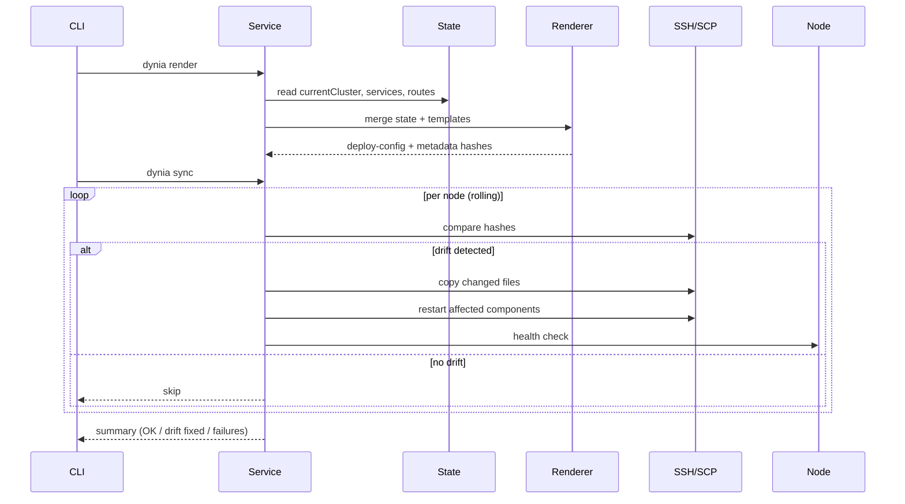

# Dynia v2 — CLI Mechanics & Lifecycle

## Mental model (what happens on any command)

```
CLI (command)
  → parse args → build DTO
  → call Service (orchestrator)
      → read/write Local State
      → render Templates → deploy-config/
      → call Providers (Node/DNS/SSH)
      → rolling sync + health checks
  → output status / errors
```

**Key pieces**

* **Local State**: the single source of truth (JSON on your machine).
* **Templates** → **deploy-config/**: rendered, immutable files ready to sync.
* **Providers**: pluggable adapters (DigitalOcean NodeProvider, Cloudflare DnsProvider, SSH provider).
* **Full mirror mode**: every node runs the same services.

---

## Lifecycle Stages (end-to-end)

1. **Bootstrap**

* Initialize local state, pick providers, set current cluster context.

2. **Cluster Creation (Infra-ready)**

* Provision nodes (no app yet).
* Render **infra layer** (HAProxy, Caddy, Keepalived) → `deploy-config/`.
* Rolling sync across nodes; attach Reserved IP to MASTER.

3. **First Deploy (Routing begins)**

* Add service(s), render app configs, sync to nodes.
* Create Cloudflare DNS **only now** (bind domain → Reserved IP).
* HAProxy routes to Caddy → to service.

4. **Operate & Evolve**

* Add nodes, update services, rotate certs, roll updates, drift-check.

5. **Failover / Repair**

* Keepalived promotes BACKUP → MASTER automatically.
* `repair` or `activate` to steer IP or re-sync infra.

6. **Teardown**

* Remove services/DNS, detach/destroy nodes, clear state.

---

## Command-by-command (mechanics + lifecycle link)

### 1) `dynia context`

* **Why**: Work on a cluster without repeating `--cluster`.
* **Subcommands**:

  * `context current` → prints current cluster from state.
  * `context use <name>` → sets `currentCluster` in state.
  * `context clear` → removes current context; forces explicit `--cluster`.
* **Lifecycle**: used anytime; affects which cluster subsequent commands target.

---

### 2) `dynia cluster create`

* **Purpose**: Provision nodes + prepare infra layer (no app yet).
* **Inputs**: `--name`, `--nodes`, `--region`, `--size`, `--node-provider`, `--dns-provider`.
* **Mechanics**:

  1. **Service** validates input; creates cluster record in Local State (providers, planned nodes).
  2. **NodeProvider** provisions VMs and returns IP/IDs.
  3. **Reserved IP** allocated (via NodeProvider).
  4. **Render infra templates** (HAProxy, Caddy, Keepalived) → `deploy-config/`.
  5. **Rolling sync** to nodes (SSH provider): copy files, restart containers/services.
  6. Attach Reserved IP to MASTER (Keepalived priority).
  7. Set `currentCluster`.
* **No DNS mapping yet** (happens on first deploy).
* **Lifecycle**: moves cluster from “planned” → **Infra-ready**.

---

### 3) `dynia cluster node add/remove/activate`

* **Why**: Grow/shrink cluster; move active role.
* **Mechanics**:

  * **add**: NodeProvider creates node → state updated → re-render infra → rolling sync → HA ready.
  * **remove**: drain (optional) → detach IP if MASTER → NodeProvider delete → re-render → sync.
  * **activate <node>**: health-check target → Keepalived priority and/or Reserved IP attach → verify.
* **Lifecycle**: scaling and operational control of HA roles.

---

### 4) `dynia render`

* **Why**: Produce the **deploy-config/** from state + templates (infra + services).
* **Outputs**:

  * `deploy-config/cluster-metadata.json`
  * component configs (`caddy/`, `haproxy/`, `keepalived/`)
  * `services/<service-name>/docker-compose.yml`
  * **metadata.json** (targetPath, permissions, SHA256 hash)
* **Idempotent**: safe to run anytime.
* **Lifecycle**: prepare a consistent artifact for syncing.

---

### 5) `dynia sync`

* **Why**: Apply `deploy-config/` to nodes with **rolling update** and **drift detection**.
* **Mechanics** (per node):

  1. Pull remote hashes (if present) and compare to local `metadata.json`.
  2. Copy only changed files.
  3. Restart only affected components (e.g., Caddy if Caddyfile changed).
  4. Health-check (`/dynia-health`, service health endpoints).
  5. Proceed to next node.
* **Lifecycle**: the safe deploy step for both infra/app changes.

---

### 6) `dynia drift-check`

* **Why**: Verify nodes match local `deploy-config/` exactly.
* **Mechanics**:

  * SSH reads file hashes on each node.
  * Compare with local metadata hashes.
  * Report: ✅ match / ⚠️ drift detected (path, expected vs actual).
* **Lifecycle**: operational integrity; run before/after sync, or on alarms.

---

### 7) `dynia deploy`

* **Why**: Create or update a service and (optionally) bind a domain.
* **Inputs**: `--name`, `--compose`, optional `--domain`, optional `--health-path`.
* **Mechanics**:

  1. Update Local State with service definition (name, ports, domain mapping).
  2. Render **app layer** configs → `deploy-config/services/<name>/…` and update Caddy/HAProxy.
  3. `dynia sync` (rolling): copy, restart service, health-check.
  4. **If domain given**: DnsProvider creates/updates DNS to **Reserved IP**.
  5. Verify end-to-end: DNS → TLS (if applicable) → health path.
* **Lifecycle**: **First deploy** is where DNS mapping finally happens.

---

### 8) `dynia route bind/unbind`

* **Why**: Attach/detach a domain to/from a service.
* **Mechanics**:

  * **bind**: update state → render routes → sync → DnsProvider create record → verify.
  * **unbind**: DnsProvider delete record → render routes → sync → verify.
* **Lifecycle**: evolves public exposure independently from service binaries.

---

### 9) `dynia repair`

* **Why**: Auto-heal infra/app drift or broken HA.
* **Modes**:

  * `repair --check-only` → report what would change.
  * `repair --force` → re-render infra + resync; re-attach Reserved IP; restart services.
* **Lifecycle**: recovery after manual changes or unexpected failures.

---

### 10) `dynia cluster delete`

* **Why**: Tear down the cluster safely.
* **Mechanics**:

  1. Unbind routes (DNS cleanup).
  2. Stop services; optional purge volumes.
  3. Detach Reserved IP; delete nodes (NodeProvider).
  4. Remove cluster from Local State; clear `currentCluster` if needed.
* **Lifecycle**: terminal stage.

---

## Internal Flows (at a glance)

### Rendering & Sync (core loop)



### Deploy with DNS binding

```mermaid
flowchart LR
  A[Local State update (service, domain)] --> B[Render app + routes -> deploy-config/]
  B --> C[Sync rolling to nodes]
  C --> D[HAProxy/Caddy reload + healthcheck]
  D --> E[DnsProvider create A/AAAA or CNAME -> Reserved IP]
  E --> F[End-to-end verify (DNS->TLS->/health)]
```

---

## Pre-/Post-conditions & Idempotency (per command)

* **create**:

  * *Pre*: no cluster with same name in state
  * *Post*: infra synced; Reserved IP attached; state updated; context set
  * Idempotent on retry (checks existence)

* **render**:

  * *Pre*: valid state
  * *Post*: fresh, complete `deploy-config/` with hashes
  * Safe to re-run anytime

* **sync**:

  * *Pre*: `deploy-config/` exists
  * *Post*: nodes converge to `deploy-config/`
  * Skips unchanged files; rolling, health-gated

* **deploy**:

  * *Pre*: compose valid; ports health-checked locally (optional)
  * *Post*: service running on all nodes; optional DNS bound
  * Idempotent (updates in place)

* **route bind/unbind**:

  * *Pre*: cluster infra ready
  * *Post*: DNS matches Reserved IP (bind) or removed (unbind)
  * Validates domain and zone

* **drift-check**:

  * *Pre*: reachable nodes
  * *Post*: report only (no mutation)

* **repair**:

  * *Pre*: none
  * *Post*: infra/app reconciled to state; IP/roles corrected

---

## What gets touched (files & systems)

* **Local**:

  * `state.json` (always via service)
  * `deploy-config/` (render output; immutable artifact)

* **Nodes (via SSH)**:

  * `/opt/dynia/{caddy|haproxy|keepalived|compose}/…`
  * service restarts (containers or system services)

* **Providers**:

  * **NodeProvider**: create/delete nodes, reserved IP ops
  * **DnsProvider**: create/update/delete records (only on route bind/deploy with domain)

---

## Error handling (quick guide)

* Provider API errors → surfaced with actionable messages (e.g., quota, auth).
* Health check failures during sync → rollback node’s changed service; stop the roll.
* Hash mismatch persists → mark node “out-of-sync” and suggest `repair`.
* DNS verify fails → keep service running, warn user to fix zone/records.