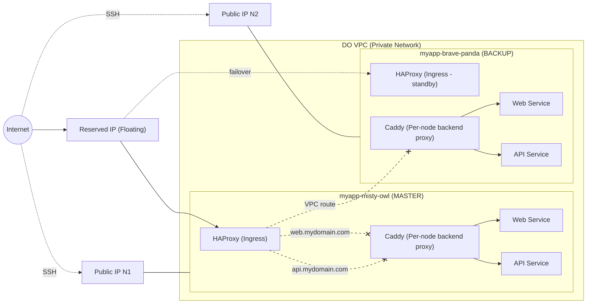

```mermaid
flowchart LR
  Internet((Internet)) --> RIP["Reserved IP (Floating)"]

  subgraph VPC["DO VPC (Private Network)"]
    subgraph N1["myapp-misty-owl (MASTER)"]
      HA1["HAProxy (Ingress)"]
      CD1["Caddy (Per-node backend proxy)"]
      W1["Web Service"]
      A1["API Service"]
    end
    subgraph N2["myapp-brave-panda (BACKUP)"]
      HA2["HAProxy (Ingress - standby)"]
      CD2["Caddy (Per-node backend proxy)"]
      W2["Web Service"]
      A2["API Service"]
    end
  end

  %% Public traffic enters only via active node's HAProxy
  RIP --> HA1
  RIP -. "failover" .-> HA2

  %% HAProxy on active node routes across VPC (logical path shown as dashed with X marker)
  HA1 --x|"web.mydomain.com"| CD1
  HA1 --x|"api.mydomain.com"| CD1
  HA1 --x|"VPC route"| CD2

  %% Caddy routes locally to services
  CD1 --> W1
  CD1 --> A1
  CD2 --> W2
  CD2 --> A2

  %% SSH access
  Internet -. "SSH" .-> PUB1["Public IP N1"]
  Internet -. "SSH" .-> PUB2["Public IP N2"]
  PUB1 --- N1
  PUB2 --- N2

  %% Style dashed for the HAProxy->Caddy links (indexes 3,4,5 in this diagram)
  linkStyle 3 stroke-dasharray: 5 5
  linkStyle 4 stroke-dasharray: 5 5
  linkStyle 5 stroke-dasharray: 5 5

```