# 🚀 Dynia Getting Started Guide

Welcome to Dynia! This guide will help you understand and deploy your first High Availability (HA) cluster from scratch. By the end of this guide, you'll have a working HTTPS service with automatic failover.

## 🎯 What is Dynia?

Dynia is a **CLI-driven orchestrator** that creates and manages **small HA clusters** in the cloud. Think of it as your personal infrastructure automation tool that:

- **Creates cloud VMs** (currently DigitalOcean)
- **Sets up HTTPS proxies** (HAProxy + Caddy)
- **Manages automatic failover** (keepalived)
- **Deploys your applications** (Docker containers)

### Why Use Dynia?

- ✅ **Simple**: One command creates a complete HA cluster
- ✅ **Automatic**: HTTPS, DNS, failover all handled for you
- ✅ **Scalable**: Start with 1 node, add more as needed
- ✅ **Reliable**: Built-in health checks and recovery
- ✅ **Affordable**: Perfect for small to medium projects

## 🏗️ Core Concepts

### High Availability (HA)
Your services run on **multiple nodes** (servers). If one fails, traffic **automatically switches** to healthy nodes.

### Reserved IP
A **stable public IP** that moves between nodes during failover. Your DNS always points here.

### Node IDs
Friendly names like `brave-panda` or `misty-owl` instead of remembering IP addresses.

### SSL Termination
**HAProxy handles HTTPS** (SSL encryption), then forwards **plain HTTP** to your services internally.

## 📋 Prerequisites

### Required Accounts

1. **DigitalOcean Account**
   - For creating cloud VMs (droplets)
   - Get API token: https://cloud.digitalocean.com/account/api/tokens

2. **Cloudflare Account** 
   - For DNS management and SSL certificates
   - Your domain must use Cloudflare nameservers
   - Get API token: https://dash.cloudflare.com/profile/api-tokens

3. **Domain Name**
   - Must be registered and using Cloudflare DNS
   - Example: `yourdomain.com`

### System Requirements

- **Node.js 22+** (for running Dynia CLI)
- **Git** (for cloning the repository)
- **pnpm** (package manager)

## 🛠️ Installation

### 1. Clone and Build Dynia

```bash
# Clone the repository
git clone https://github.com/thaitype/dynia.git
cd dynia

# Install dependencies
pnpm install

# Build the project
pnpm build

# Navigate to basic example
cd examples/basic
```

### 2. Set Up Environment Variables

Create a `.env` file with your API credentials:

```bash
# Copy the example file
cp ../../.env.example .env
```

Edit `.env` and fill in your credentials:

```bash
# DigitalOcean API Token
DYNIA_DO_TOKEN=dop_v1_your_digitalocean_token_here

# Cloudflare API Token (Zone:Edit permissions)
DYNIA_CF_TOKEN=your_cloudflare_token_here

# Cloudflare User Service Key (for Origin Certificates)
DYNIA_CF_API_KEY=your_cloudflare_user_service_key_here

# Cloudflare Zone ID (from domain overview page)
DYNIA_CF_ZONE_ID=your_zone_id_here
```

### 3. Create SSH Key

Dynia needs an SSH key to access your cloud VMs:

```bash
# Create SSH key and upload to DigitalOcean
pnpm dynia ssh create --output-env

# Copy the SSH_KEY_ID from output to your .env file
echo "DYNIA_SSH_KEY_ID=12345678" >> .env
```

## 🎯 Your First HA Cluster

Let's create your first High Availability cluster step by step.

### Step 1: Create the Cluster

```bash
# Create an HA cluster with one node
pnpm dynia cluster create-ha \
  --name myapp \
  --base-domain yourdomain.com \
  --region nyc3
```

**What happens:**
- Creates a DigitalOcean droplet (Ubuntu 22.04)
- Reserves a public IP address
- Sets up DNS A record
- Assigns a friendly node ID (e.g., `brave-panda`)

### Step 2: Prepare Infrastructure

```bash
# Install Docker, HAProxy, Caddy, and keepalived on all nodes
pnpm dynia cluster prepare myapp
```

**What happens:**
- Installs Docker and Docker Compose
- Sets up HAProxy for SSL termination
- Configures Caddy for HTTP proxying
- Installs keepalived for failover
- Provisions SSL certificates

### Step 3: Deploy a Test Service

```bash
# Deploy placeholder service for testing
pnpm dynia cluster deployment create \
  --name myapp \
  --placeholder
```

**What happens:**
- Creates Docker containers for your service
- Configures host-based routing
- Sets up health checks
- Service becomes available at your domain

### Step 4: Verify Your Deployment

```bash
# Check cluster status
pnpm dynia cluster list

# Check nodes in your cluster
pnpm dynia cluster node list --name myapp

# Check certificate status
pnpm dynia cluster certificate status --name myapp
```

Your service should now be accessible at:
`https://dynia-placeholder-myapp.yourdomain.com`

## 🔧 Understanding the Architecture

### Request Flow

```mermaid
graph TB
    User[👤 User] --> CF[☁️ Cloudflare]
    CF --> RIP[🌐 Reserved IP]
    RIP --> HA[⚖️ HAProxy<br/>SSL Termination]
    HA --> Caddy[🔄 Caddy<br/>HTTP Proxy]
    Caddy --> Docker[🐳 Docker<br/>Your Service]
    
    style CF fill:#f96,color:#fff
    style HA fill:#4a9,color:#fff
    style Caddy fill:#06f,color:#fff
    style Docker fill:#2196f3,color:#fff
```



### Node Architecture

Each node in your cluster runs:


### Multi-Node HA Setup


## 📈 Scaling Your Cluster

### Add More Nodes

```bash
# Add 2 more nodes for redundancy
pnpm dynia cluster node add --name myapp --count 2

# Prepare the new nodes
pnpm dynia cluster prepare myapp

# Check all nodes are healthy
pnpm dynia cluster node list --name myapp
```

### Test Failover

```bash
# Manually activate a different node
pnpm dynia cluster node activate --name myapp --node misty-owl

# Verify the Reserved IP moved
pnpm dynia cluster reserved-ip list
```

## 🔒 SSL and Security

### How SSL Works in Dynia

1. **Cloudflare** handles edge SSL (user → Cloudflare)
2. **HAProxy** handles origin SSL (Cloudflare → HAProxy) 
3. **Internal traffic** is HTTP (HAProxy → services)

### Certificate Types

- **Cloudflare Origin Certificates**: 15-year validity, trusted by Cloudflare
- **Self-signed fallback**: If Origin CA fails
- **Let's Encrypt**: For non-Cloudflare domains (future)

### Security Headers

HAProxy automatically adds:
- `Strict-Transport-Security` (HSTS)
- `X-Frame-Options` (prevent clickjacking)  
- `X-Content-Type-Options` (MIME sniffing protection)
- `X-XSS-Protection` (XSS filtering)

## 🚢 Deploying Your Application

### Using Docker Compose

Create `docker-compose.yml` for your application:

```yaml
version: '3.8'
services:
  webapp:
    image: nginx:alpine
    ports:
      - "8081:80"
    volumes:
      - ./html:/usr/share/nginx/html
    restart: unless-stopped
    healthcheck:
      test: ["CMD", "wget", "--quiet", "--tries=1", "--spider", "http://localhost/"]
      interval: 30s
      timeout: 10s
      retries: 3
      start_period: 40s
```

Deploy your application:

```bash
pnpm dynia cluster deployment create \
  --name myapp \
  --compose ./docker-compose.yml \
  --domain webapp-myapp.yourdomain.com \
  --health-path /
```

### Important Notes

- Use **single-level subdomains**: `webapp.yourdomain.com` ✅
- Avoid **multi-level**: `webapp.myapp.yourdomain.com` ❌
- Include **health checks** in your services
- Use **port 8081+** for your services (8080 is reserved for Caddy)

## 🔍 Monitoring and Health

### Check Cluster Health

```bash
# Overall cluster status
pnpm dynia cluster repair-ha myapp --check-only

# Individual node status
pnpm dynia cluster node list --name myapp

# Certificate status
pnpm dynia cluster certificate status --name myapp

# Reserved IP assignments
pnpm dynia cluster reserved-ip list
```

### View Infrastructure Details

```bash
# Inspect cluster configuration
pnpm dynia cluster config inspect --name myapp

# View HAProxy configuration
pnpm dynia cluster config inspect --name myapp --component haproxy

# View routing information
pnpm dynia cluster config inspect --name myapp --routes
```

## 🚨 Common Issues and Solutions

### 1. SSL Certificate Problems

**Problem**: `526 Invalid SSL Certificate` error

**Solutions**:
```bash
# Recreate certificates
pnpm dynia cluster certificate provision --name myapp --force

# Check certificate status
pnpm dynia cluster certificate status --name myapp
```

### 2. Service Returns 502 Bad Gateway

**Problem**: HAProxy can't reach your service

**Solutions**:
```bash
# Check if service is running
ssh -i ~/.ssh/dynia root@NODE_IP "docker ps"

# Check service health
ssh -i ~/.ssh/dynia root@NODE_IP "docker logs CONTAINER_NAME"

# Verify port configuration (services should use 8081+)
```

### 3. Failover Not Working

**Problem**: Reserved IP doesn't move during failover

**Solutions**:
```bash
# Check keepalived status
pnpm dynia cluster node list --name myapp

# Manually trigger failover
pnpm dynia cluster node activate --name myapp --node OTHER_NODE

# Repair cluster infrastructure
pnpm dynia cluster repair-ha myapp --force
```

### 4. DNS Resolution Issues

**Problem**: Domain doesn't resolve to Reserved IP

**Solutions**:
```bash
# Check DNS records
dig yourdomain.com
nslookup yourdomain.com

# Verify Cloudflare configuration
# - Check A record points to Reserved IP
# - Ensure proxy is enabled (orange cloud)
```

## 🎉 Next Steps

Congratulations! You now have a working HA cluster. Here's what to do next:

### Production Readiness

1. **Add monitoring**: Set up uptime monitoring for your services
2. **Backup strategy**: Plan for data backups if you store persistent data
3. **Scale testing**: Test your application under load
4. **Security review**: Review firewall rules and access patterns

### Advanced Features

1. **Multiple services**: Deploy different applications to the same cluster
2. **Custom domains**: Use different subdomains for different services  
3. **Health check tuning**: Optimize health check intervals
4. **Logging**: Set up centralized logging for troubleshooting

### Learn More

- [Architecture Deep Dive](architecture.md) - Understand how everything works
- [Infrastructure Details](infrastructure.md) - Server setup and configuration
- [Troubleshooting Guide](troubleshooting.md) - Solutions for common problems

## 🤝 Getting Help

- **GitHub Issues**: [Report bugs or request features](https://github.com/thaitype/dynia/issues)
- **Documentation**: Check other guides in the `docs/` folder
- **Command Help**: Run `pnpm dynia --help` or `pnpm dynia COMMAND --help`

---

**🎊 Welcome to the Dynia community!** You're now ready to build reliable, scalable applications with automatic failover.