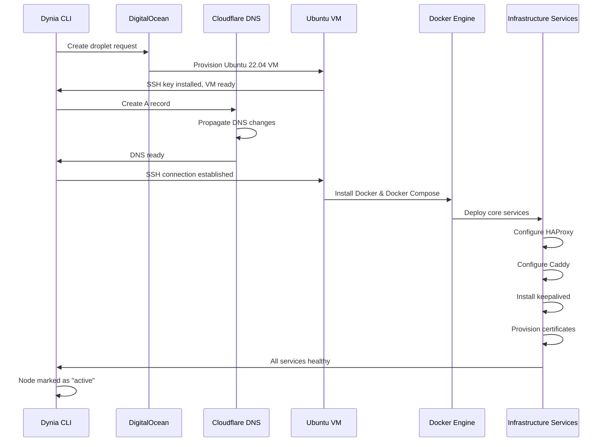
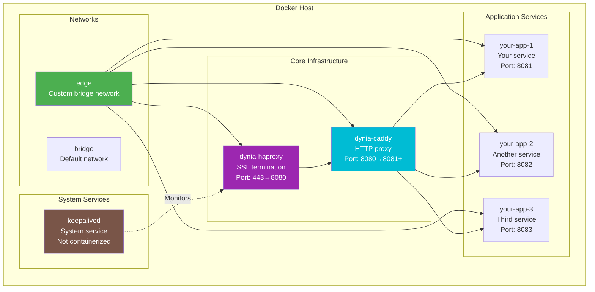
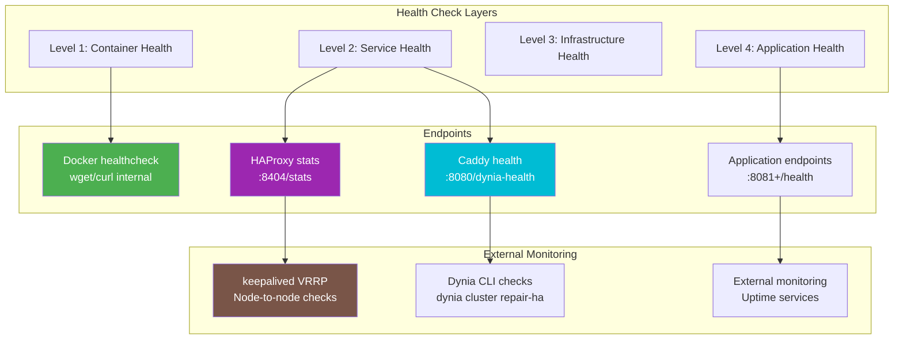

# 🏗️ Infrastructure Deep Dive

This document provides detailed technical information about how Dynia sets up and manages infrastructure on your nodes (virtual machines).

## 🖥️ Server Setup Process

### Complete Node Provisioning



### Directory Structure on Nodes

For detailed information about all files and directories on cluster nodes, including the infrastructure and application layers, see the **[Node Filesystem Reference](node-filesystem.md)**.

**Quick overview**:

```
/opt/dynia/                     # Main Dynia directory
├── caddy/                      # Caddy reverse proxy configs
├── haproxy/                    # HAProxy load balancer configs
└── compose/                    # Application service deployments
    └── [service-domain]/       # Each deployed service

/etc/keepalived/               # keepalived HA configuration
├── keepalived.conf           # VRRP failover settings
└── scripts/                  # Health monitoring scripts

/var/log/                     # System logs
├── haproxy.log               # Load balancer logs
├── caddy/                    # Reverse proxy logs
└── keepalived.log           # Failover event logs
```

## 🐳 Docker Infrastructure

### Container Architecture



### Docker Compose Configuration

```yaml
# /root/docker-compose.yml - Generated by Dynia
version: '3.8'

networks:
  edge:
    driver: bridge
    ipam:
      config:
        - subnet: 172.20.0.0/16

services:
  # HAProxy - SSL Termination (tlsMode 1 only)
  dynia-haproxy:
    image: haproxy:2.8-alpine
    container_name: dynia-haproxy
    ports:
      - "443:443"      # HTTPS traffic
      - "8404:8404"    # HAProxy stats
    volumes:
      - /etc/haproxy/haproxy.cfg:/usr/local/etc/haproxy/haproxy.cfg:ro
      - /etc/haproxy/certs:/etc/haproxy/certs:ro
    networks:
      - edge
    restart: unless-stopped
    healthcheck:
      test: ["CMD", "haproxy", "-c", "-f", "/usr/local/etc/haproxy/haproxy.cfg"]
      interval: 30s
      timeout: 10s
      retries: 3
      start_period: 10s

  # Caddy - HTTP Proxy  
  dynia-caddy:
    image: caddy:2.7-alpine
    container_name: dynia-caddy
    ports:
      - "8080:80"      # HTTP proxy port
      - "2019:2019"    # Caddy admin API (optional)
    volumes:
      - /etc/caddy/Caddyfile:/etc/caddy/Caddyfile:ro
    networks:
      - edge
    restart: unless-stopped
    healthcheck:
      test: ["CMD", "wget", "--quiet", "--tries=1", "--spider", "http://localhost/dynia-health"]
      interval: 10s
      timeout: 5s
      retries: 3
      start_period: 10s

  # Example Application Service - deployed via 'dynia cluster deployment create'
  your-app-1:
    image: nginx:alpine
    container_name: your-app-1
    ports:
      - "8081:80"
    volumes:
      - ./app-data:/usr/share/nginx/html:ro
    networks:
      - edge  
    restart: unless-stopped
    healthcheck:
      test: ["CMD", "wget", "--no-verbose", "--tries=1", "--spider", "http://localhost/"]
      interval: 30s
      timeout: 10s
      retries: 3
      start_period: 20s
```

### Container Resource Limits

```yaml
# Production resource constraints
services:
  dynia-haproxy:
    deploy:
      resources:
        limits:
          memory: 128M
          cpus: '0.5'
        reservations:
          memory: 64M
          cpus: '0.2'
    
  dynia-caddy:
    deploy:
      resources:
        limits:
          memory: 64M
          cpus: '0.3'
        reservations:
          memory: 32M
          cpus: '0.1'
    
  your-app-1:
    deploy:
      resources:
        limits:
          memory: 256M
          cpus: '0.5'
        reservations:
          memory: 128M
          cpus: '0.25'
```

## ⚖️ HAProxy Configuration

### Complete HAProxy Setup

```haproxy
# /etc/haproxy/haproxy.cfg - Generated by Dynia
global
    daemon
    log 127.0.0.1:514 local0 info
    chroot /var/lib/haproxy
    stats socket /run/haproxy/admin.sock mode 660 level admin
    stats timeout 30s
    user haproxy
    group haproxy
    maxconn 4096
    
    # TLS Configuration - Modern security
    ssl-default-bind-ciphers ECDHE-ECDSA-AES256-GCM-SHA384:ECDHE-RSA-AES256-GCM-SHA384:ECDHE-ECDSA-CHACHA20-POLY1305
    ssl-default-bind-ciphersuites TLS_AES_256_GCM_SHA384:TLS_CHACHA20_POLY1305_SHA256:TLS_AES_128_GCM_SHA256
    ssl-default-bind-options ssl-min-ver TLSv1.2 no-tls-tickets no-sslv3
    ssl-default-server-ciphers ECDHE-ECDSA-AES256-GCM-SHA384:ECDHE-RSA-AES256-GCM-SHA384
    ssl-default-server-options ssl-min-ver TLSv1.2 no-tls-tickets

defaults
    mode http
    log global
    option httplog
    option dontlognull
    option log-health-checks
    option forwardfor
    option http-server-close
    timeout connect 5000ms
    timeout client 50000ms
    timeout server 50000ms
    retries 3
    
    # Error pages
    errorfile 400 /etc/haproxy/errors/400.http
    errorfile 403 /etc/haproxy/errors/403.http  
    errorfile 408 /etc/haproxy/errors/408.http
    errorfile 500 /etc/haproxy/errors/500.http
    errorfile 502 /etc/haproxy/errors/502.http
    errorfile 503 /etc/haproxy/errors/503.http
    errorfile 504 /etc/haproxy/errors/504.http

# HAProxy Statistics Interface  
listen stats
    bind *:8404
    stats enable
    stats uri /stats
    stats refresh 30s
    stats admin if TRUE
    stats show-legends
    stats show-node
    stats auth admin:dynia-admin

# Frontend - HTTP Traffic (redirect to HTTPS)
frontend public_http
    bind *:80
    mode http
    
    # Security headers for HTTP
    http-response set-header X-Frame-Options DENY
    http-response set-header X-Content-Type-Options nosniff
    
    # ACME challenge support (for Let's Encrypt if needed)
    acl is_acme_challenge path_beg /.well-known/acme-challenge/
    use_backend acme_challenge if is_acme_challenge
    
    # Redirect all HTTP to HTTPS
    redirect scheme https code 301 if !{ ssl_fc }

# Frontend - HTTPS Traffic (SSL termination)  
frontend public_https
    bind *:443 ssl crt /etc/haproxy/certs/
    mode http
    
    # Security headers for HTTPS
    http-response set-header Strict-Transport-Security "max-age=31536000; includeSubDomains; preload"
    http-response set-header X-Frame-Options DENY
    http-response set-header X-Content-Type-Options nosniff
    http-response set-header X-XSS-Protection "1; mode=block"
    http-response set-header Referrer-Policy "strict-origin-when-cross-origin"
    http-response set-header Permissions-Policy "geolocation=(), microphone=(), camera=()"
    
    # Forward real client IP to backend
    http-request set-header X-Forwarded-Proto https
    http-request set-header X-Forwarded-For %[src]
    http-request set-header X-Real-IP %[src]
    
    # Rate limiting (basic protection)
    stick-table type ip size 100k expire 30s store http_req_rate(10s)
    http-request track-sc0 src
    http-request reject if { sc_http_req_rate(0) gt 20 }
    
    # Host-based routing ACLs  
    # These are dynamically added by Dynia deployments
    # acl host_api hdr(host) -i api.yourdomain.com
    # use_backend api_backend if host_api
    
    # Default backend - forward to Caddy HTTP proxy
    default_backend caddy_http_backend

# Backend - Caddy HTTP Proxy
backend caddy_http_backend
    mode http
    balance roundrobin
    option httpchk GET /dynia-health
    http-check expect status 200
    
    # Enable compression
    compression algo gzip
    compression type text/html text/plain text/css text/javascript application/javascript application/json application/xml
    
    # Backend servers (all cluster nodes)
    server caddy-node1 127.0.0.1:8080 check inter 5s fall 3 rise 2 weight 100
    # server caddy-node2 NODE2_IP:8080 check inter 5s fall 3 rise 2 weight 100
    # Additional nodes added dynamically

# Backend - ACME Challenge (for Let's Encrypt)
backend acme_challenge
    mode http
    server caddy-acme 127.0.0.1:8080 check
```

### HAProxy SSL Certificate Management

```bash
#!/bin/bash
# /etc/haproxy/scripts/update-cert.sh - Certificate update script

DOMAIN="yourdomain.com"
CERT_DIR="/etc/haproxy/certs"
BACKUP_DIR="/etc/haproxy/backup"

# Backup existing certificates
cp "$CERT_DIR/$DOMAIN.pem" "$BACKUP_DIR/$DOMAIN.pem.$(date +%s)" 2>/dev/null || true

# Combine certificate and private key into PEM format
cat "$CERT_DIR/$DOMAIN.crt" "$CERT_DIR/$DOMAIN.key" > "$CERT_DIR/$DOMAIN.pem"

# Set proper permissions
chmod 600 "$CERT_DIR/$DOMAIN.pem"
chown root:root "$CERT_DIR/$DOMAIN.pem"

# Reload HAProxy configuration
systemctl reload haproxy

echo "Certificate updated for $DOMAIN"
```

## 🔄 Caddy Configuration

### HTTP Proxy Setup

```caddyfile
# /etc/caddy/Caddyfile - Generated by Dynia
# HTTP-only mode for tlsMode 1 (HAProxy handles SSL)

{
    # Global options
    auto_https off
    admin off
    log {
        output file /var/log/caddy/access.log
        format json
    }
}

# Main HTTP server (receives traffic from HAProxy)
:80 {
    # Health check endpoint for HAProxy backend checks
    handle_path /dynia-health {
        respond "Dynia Node: {$NODE_NAME} - OK" 200 {
            header Content-Type "text/plain; charset=utf-8"
            header Cache-Control "no-cache, no-store, must-revalidate"
        }
    }
    
    # Host-based routing for different services
    # These rules are dynamically managed by Dynia
    
    @api host api.yourdomain.com
    handle @api {
        reverse_proxy http://api-service:8082 {
            header_up Host {upstream_hostport}
            header_up X-Forwarded-Proto {scheme}
            header_up X-Forwarded-For {remote}
            health_uri /health
            health_interval 30s
            health_timeout 5s
        }
    }
    
    @webapp host webapp.yourdomain.com
    handle @webapp {
        reverse_proxy http://webapp-service:8083 {
            header_up Host {upstream_hostport}
            header_up X-Forwarded-Proto {scheme}
            header_up X-Forwarded-For {remote}
        }
    }
    
    # Default handler - your application service
    handle {
        reverse_proxy http://your-app-1:80 {
            header_up Host {upstream_hostport}
            header_up X-Forwarded-Proto {scheme}
            header_up X-Forwarded-For {remote}
        }
    }
    
    # Logging configuration
    log {
        output file /var/log/caddy/access.log
        format json {
            time_format "iso8601"
            level_format "lower"
        }
    }
}

# Health check server (alternative port if needed)
:2019 {
    respond /health "OK" 200
    respond /ready "Ready" 200  
    respond /metrics "# Caddy metrics endpoint" 200
}
```

### Caddy Service Management

```bash
#!/bin/bash
# /etc/systemd/system/caddy.service - If running as system service

[Unit]
Description=Caddy HTTP/2 web server
Documentation=https://caddyserver.com/docs/
After=network-online.target
Wants=network-online.target

[Service]
Type=notify
User=caddy
Group=caddy
ExecStart=/usr/bin/caddy run --environ --config /etc/caddy/Caddyfile
ExecReload=/usr/bin/caddy reload --config /etc/caddy/Caddyfile
TimeoutStopSec=5s
KillMode=mixed
KillSignal=SIGQUIT
LimitNOFILE=1048576
LimitNPROC=1048576
PrivateTmp=true
PrivateDevices=true
ProtectHome=true
ProtectSystem=strict
ReadWritePaths=/var/lib/caddy /var/log/caddy
CapabilityBoundingSet=CAP_NET_BIND_SERVICE
AmbientCapabilities=CAP_NET_BIND_SERVICE
NoNewPrivileges=true

[Install]
WantedBy=multi-user.target
```

## 🔄 keepalived Implementation

### Complete keepalived Configuration

```bash
# /etc/keepalived/keepalived.conf - Generated by Dynia

# Global settings
global_defs {
    router_id DYNIA_NODE_1
    enable_script_security
    script_user keepalived_script
    script_group keepalived_script
}

# Health check script
vrrp_script chk_haproxy {
    script "/etc/keepalived/scripts/check_haproxy.sh"
    interval 3          # Check every 3 seconds
    timeout 2           # Script timeout
    weight -2           # Reduce priority by 2 on failure
    fall 3              # Require 3 failures to be considered down
    rise 2              # Require 2 successes to be considered up
}

# VRRP instance for Reserved IP management
vrrp_instance VI_1 {
    state MASTER                    # Initial state (MASTER or BACKUP)
    interface eth0                  # Network interface
    virtual_router_id 51           # Must be same across all nodes
    priority 100                   # Higher = preferred master (90, 80, 70...)
    advert_int 1                   # Advertisement interval (seconds)
    
    authentication {
        auth_type PASS
        auth_pass dynia_cluster_secret
    }
    
    virtual_ipaddress {
        138.197.55.84/24 dev eth0    # Reserved IP address
    }
    
    track_script {
        chk_haproxy                  # Use HAProxy health check
    }
    
    # Notify scripts for state changes
    notify_master "/etc/keepalived/scripts/notify_master.sh"
    notify_backup "/etc/keepalived/scripts/notify_backup.sh"
    notify_fault  "/etc/keepalived/scripts/notify_fault.sh"
    
    # Advanced settings
    nopreempt                       # Don't take over unless current master fails
    garp_master_delay 2             # Delay gratuitous ARP
    garp_master_repeat 3            # Repeat gratuitous ARP
    garp_master_refresh 60          # Refresh gratuitous ARP
}
```

### Health Check Scripts

```bash
#!/bin/bash
# /etc/keepalived/scripts/check_haproxy.sh - HAProxy health check

# Check if HAProxy is running
if ! pgrep haproxy > /dev/null; then
    echo "HAProxy process not running"
    exit 1
fi

# Check if HAProxy is responding on port 443
if ! timeout 2 bash -c "</dev/tcp/localhost/443"; then
    echo "HAProxy not responding on port 443"
    exit 1
fi

# Check HAProxy stats page
if ! curl -sf http://localhost:8404/stats > /dev/null; then
    echo "HAProxy stats not accessible"
    exit 1
fi

# Check backend health via Caddy health endpoint
if ! curl -sf http://localhost:8080/dynia-health > /dev/null; then
    echo "Backend services not healthy"
    exit 1
fi

echo "All health checks passed"
exit 0
```

```bash
#!/bin/bash  
# /etc/keepalived/scripts/notify_master.sh - Became master notification

NODE_NAME=$(hostname)
TIMESTAMP=$(date '+%Y-%m-%d %H:%M:%S')

echo "[$TIMESTAMP] $NODE_NAME became MASTER" >> /var/log/keepalived.log

# Optional: Send notification to monitoring system
# curl -X POST https://monitoring.yourdomain.com/api/alerts \
#   -H "Content-Type: application/json" \
#   -d "{\"message\": \"$NODE_NAME became MASTER\", \"timestamp\": \"$TIMESTAMP\"}"

# Ensure HAProxy is running and healthy
systemctl is-active --quiet haproxy || systemctl restart haproxy
```

```bash
#!/bin/bash
# /etc/keepalived/scripts/notify_backup.sh - Became backup notification  

NODE_NAME=$(hostname)
TIMESTAMP=$(date '+%Y-%m-%d %H:%M:%S')

echo "[$TIMESTAMP] $NODE_NAME became BACKUP" >> /var/log/keepalived.log
```

## 🔒 Security Configuration

### Firewall Rules (UFW)

```bash
#!/bin/bash
# /etc/dynia/scripts/setup-firewall.sh - Firewall configuration

# Reset UFW to defaults
ufw --force reset

# Default policies
ufw default deny incoming
ufw default allow outgoing

# SSH access (essential - don't lock yourself out!)
ufw allow 22/tcp comment 'SSH access'

# HTTP/HTTPS traffic
ufw allow 80/tcp comment 'HTTP traffic'
ufw allow 443/tcp comment 'HTTPS traffic'

# HAProxy stats (optional, can be restricted by IP)
ufw allow from 10.0.0.0/8 to any port 8404 comment 'HAProxy stats internal'

# Caddy admin (if enabled, should be restricted)
# ufw allow from 127.0.0.1 to any port 2019 comment 'Caddy admin local only'

# VRRP for keepalived (multicast)
ufw allow from 224.0.0.0/8 comment 'VRRP multicast'
ufw allow to 224.0.0.0/8 comment 'VRRP multicast'

# Inter-node communication (adjust subnet as needed)
ufw allow from 10.0.0.0/8 comment 'Inter-node communication'

# Docker network communication
ufw allow from 172.16.0.0/12 comment 'Docker networks'

# Enable firewall
ufw --force enable

echo "Firewall configured successfully"
```

### SSL/TLS Security Headers

```bash
# Security headers added by HAProxy
Strict-Transport-Security: max-age=31536000; includeSubDomains; preload
X-Frame-Options: DENY
X-Content-Type-Options: nosniff  
X-XSS-Protection: 1; mode=block
Referrer-Policy: strict-origin-when-cross-origin
Permissions-Policy: geolocation=(), microphone=(), camera=()
```

### Log Rotation Configuration

```bash
# /etc/logrotate.d/dynia - Log rotation for Dynia services

/var/log/haproxy.log {
    daily
    rotate 14
    compress
    delaycompress
    missingok
    notifempty
    postrotate
        systemctl reload rsyslog
    endscript
}

/var/log/caddy/*.log {
    daily  
    rotate 14
    compress
    delaycompress
    missingok
    notifempty
    postrotate
        docker kill -s USR1 dynia-caddy 2>/dev/null || true
    endscript
}

/var/log/keepalived.log {
    daily
    rotate 30
    compress
    delaycompress
    missingok
    notifempty
    postrotate
        systemctl reload keepalived
    endscript
}
```

## 📊 Monitoring and Observability  

### Health Check Endpoints



### Performance Monitoring

```bash
#!/bin/bash
# /etc/dynia/scripts/system-metrics.sh - Basic system monitoring

# System resources
echo "=== System Resources ==="
free -h
df -h /
uptime

# Docker resource usage  
echo -e "\n=== Docker Resources ==="
docker stats --no-stream --format "table {{.Name}}\t{{.CPUPerc}}\t{{.MemUsage}}\t{{.MemPerc}}"

# Network connections
echo -e "\n=== Network Connections ==="
ss -tuln | grep -E ':(80|443|8080|8404)'

# HAProxy statistics
echo -e "\n=== HAProxy Status ==="
echo "show stat" | socat stdio /run/haproxy/admin.sock | cut -d',' -f1,2,5,6,7,8,17,18

# keepalived status  
echo -e "\n=== keepalived Status ==="
systemctl is-active keepalived
ip addr show | grep -A2 -B2 "138.197.55.84" || echo "Reserved IP not on this node"
```

This infrastructure deep-dive should give you a complete understanding of how Dynia sets up and configures your nodes, from the operating system level all the way up to application deployment.

---

**Next**: [Troubleshooting Guide](troubleshooting.md) - Learn how to diagnose and fix common issues.